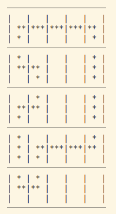
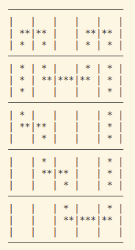
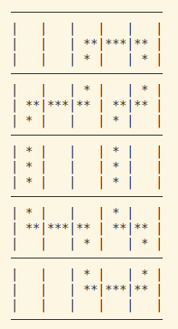
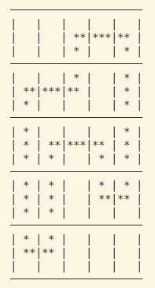
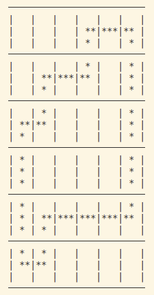
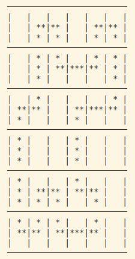

# Grill project

## Binôme
* Camelia Mazouz
* Maya Soufan

# Variables du modèle
- x[i,j] : Variables binaires représentant l'état de chaque case de la grille de dimension n×n. La case  prend la valeur 1 si la case aux coordonnées (i,j) est occupée par une étoile  et 0 sinon.
- up[i,j], down[i,j], left[i,j], right[i,j] : Variables binaires représentant les directions de connexion pour chaque case (des entrées et dessorties d'une case). Pour une case (i,j), ces variables prennent la valeur 1 si la direction correspondante est utilisée (faisant partie du parcours fermé), et 0 sinon. 

# Contraintes mises en place
* Contraintes sur le nombre de cases occupées par ligne et par colonne : le nombre de case doit etre egal au chiffre ligne/colonne
* Chaque case a 1 entrée et 1 sortie (soit 2 directions actives)
* Contraintes de cohérence des arcs (les flèches doivent être "réciproques") : verfie si la direction de l'entrée i et de la sortie i-1 sont la meme
* Directions bloqués pour les bords : si on est a l'extremite droite on peut pas aller a droite

# Sous tours
* Pour la detexction de sosus tours on applique un parcours en profondeur afin de calculer les composantes connexes et ainsi detecter les sous tours.
    * Construciton du graphe pour applique le DFS : le graphe est l'ensemble des cases occupées
    * Les aretes sont les connexions entre les cases
    * On applique un DFS sur le graphe, une fois le parcours fait, on le compare avec l'ensemble de noeuds de depart (toutes les cellules occupées de la grille). Si il manque des cellules dans le resultat du DFS cela veut dire qu'il y'a un sous-tour.
    * Lorsequ'un sous-tour est trouvé, on identifie les sommets impliqués, on ajoute une contrainte qui force les sommets du sous-tour a avoir au moins 2 connexions avec son complément.

# Affichage de la grille

- displayGrid: affiche la solution sous forme d'un tableau avec des fléches pour décrires les directions de sorties et d'entrées ( "↑↓", "←→", "↑→",)
- print_grid_stars : affiche la grille avec 3 étoiles par cellule 3*3 comme dans l'image donnée dans l'énoncée.
**NB** : La première version de l'affiche a été faite car la visualisation de la solution  est plus simple pour gérer les erreurs et déboguer, qu'avec plusieurs étoiles.

# RESULTATS
- Exemple :

- Jeu 1:

- Jeu 2:

- Jeu 3: 

- Jeu 4:

- Jeu 5:

