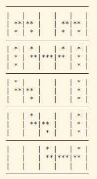
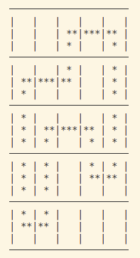
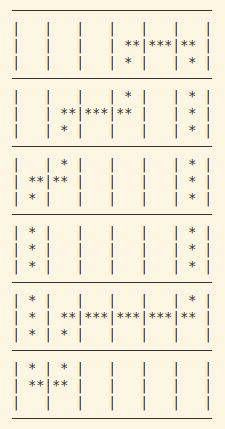

# Julia Star Game Grids

## Overview

This repository contains a mathematical modeling and optimization solution for the "Tour de Ville" puzzle, inspired by puzzles featured in the magazines "La Recherche" and "Tangente". The puzzle involves determining a unique continuous path within a grid, respecting given numerical constraints on each row and column.

## Objectif

The goal is to form a unique, continuous circuit passing exactly once through each grid cell, with numerical clues indicating the number of horizontal and vertical segments present in each respective row and column.
## Binôme
* Camelia Mazouz
* Maya Soufan

# Implementation 

- The solution uses integer linear programming (ILP) modeling techniques.
- Implemented using the JuMP optimization library and a linear solver compatible with JuMP (such as Cbc).

# Model Variables
- x[i,j] : Binary variables representing the state of each cell in an n×n grid. A cell takes the value 1 if the cell at coordinates (i,j) is occupied by a star, otherwise 0.
- up[i,j], down[i,j], left[i,j], right[i,j] : Binary variables representing connection directions for each cell (inputs and outputs). For a cell (i,j), these variables take the value 1 if the corresponding direction is used (part of the closed loop), otherwise 0.

# Constraints
* Constraints on the number of occupied cells per row and column: The number of cells must match the number given for each row/column.
* Each cell has 1 input and 1 output (thus 2 active directions).
* Arc coherence constraints: Verify that the input direction for cell i matches the output direction for cell i-1.
* Blocked directions at borders: Cells on the grid edges cannot have directions pointing outside the grid.

# Sub-tours Detection
* To detect sub-tours, a Depth-First Search (DFS) is applied to identify connected components and thus detect any sub-tours.
    * Graph construction for DFS: The graph consists of occupied cells, with edges representing connections between cells.
    * DFS is applied to the graph. After traversal, the result is compared with the initial set of nodes (all occupied cells in the grid). Missing nodes in the DFS result indicate a sub-tour.
    * When a sub-tour is found, involved vertices are identified, and a constraint is added to force these vertices to have at least two connections with the complementary vertices.

# Grid Display

* displayGrid: Displays the solution in the form of a table with arrows indicating input and output directions ("↑↓", "←→", "↑→").
* print_grid_stars: Displays the grid with 3 stars per 3×3 cell, as shown in the provided image. The initial version of this display was made for simpler visualization to manage errors and debug compared to multiple stars.

# Results
| Name     | Image                                                                                         |
|---------|-----------------------------------------------------------------------------------------------|
| Exemple |                                               |
| Game 1   |                                                 |
| Game 2   |                                                  |
| Game 3   |                                                   |
| Game 4   |                                                  |
| Game 5   |                                                 |

## Usage

* Clone the repository.
* Install necessary dependencies (Julia, JuMP, solver).
* Run the solving script provided.

